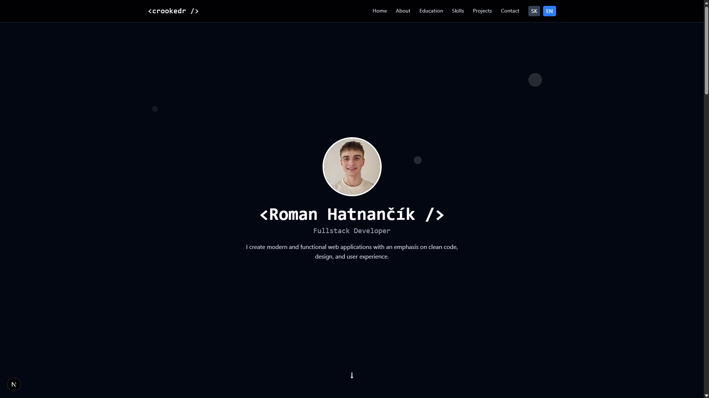

# 👤 Aboutme – Personal Website

💻 Moderná, responzívna stránka **"O mne"** postavená na **Next.js** a **Tailwind CSS**.  
🎯 Slúži ako digitálna vizitka – prezentuje moje zručnosti, vzdelanie, projekty a ponúka rýchly kontakt.  
⚡️ Elegantný dizajn, hladké animácie a skvelý UX pre moderné portfólio.

---

## 📸 Náhľad



---

## ✨ Funkcie

- ✅ Moderný tmavý dizajn  
- ✅ Plne responzívna  
- ✅ Framer Motion animácie  
- ✅ Kontaktný formulár cez Formspree  
- ✅ Komponentová architektúra (Next.js App Router)  
- ✅ Pripravené na viacjazyčnú podporu (SVK/ENG)

---

## 🛠 Použité technológie

- ⚙️ [Next.js](https://nextjs.org/) – React framework  
- 🎨 [Tailwind CSS](https://tailwindcss.com/) – utility-first styling  
- 🎥 [Framer Motion](https://www.framer.com/motion/) – animácie  
- 📬 [Formspree](https://formspree.io/) – odosielanie správ  
- 🧠 [TypeScript](https://www.typescriptlang.org/) – typová istota  
- 🧰 [Git + GitHub](https://git-scm.com/) – verzovanie a správa kódu

---

## 📂 Štruktúra projektu

```
aboutme/
├── public/
│   ├── icons/
│   └── images/
├── src/
│   └── app/
│       ├── components/
│       ├── globals.css
│       ├── layout.tsx
│       └── page.tsx
├── README.md
├── package.json
├── tsconfig.json
└── tailwind.config.js
```
---

## Online

Stránka je dostupná na mojej doméne: [www.crookedr.com](https://crookedr.com/)

---

## 🧪 Lokálne spustenie

```bash
git clone https://github.com/crookedr/aboutme.git
cd aboutme
npm install
npm run dev
```

Stránka sa spustí na [http://localhost:3000](http://localhost:3000)

---

## 📬 Kontakt

Stránka obsahuje kontaktný formulár, cez ktorý mi môžete napísať správu.  
Nájdete ma tiež na LinkedIne alebo Discorde – všetko pekne prístupné v sekcii Kontakt.

---

### Made with ❤️ by [crookedr](https://github.com/crookedr)
